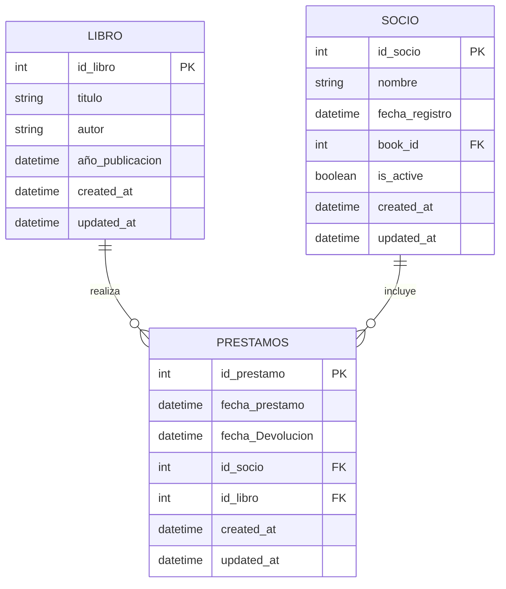

```mermaid
erDiagram
LIBRO ||--o{ PRESTAMOS : realiza
SOCIO ||--o{ PRESTAMOS : incluye
    LIBRO {
        int id_libro PK
        string titulo
        string autor
        datetime año_publicacion
        datetime created_at
        datetime updated_at
    }
    SOCIO {
        int id_socio PK
        string nombre
        datetime fecha_registro
        int book_id FK
        boolean is_active
        datetime created_at
        datetime updated_at
    }
    PRESTAMOS {
        int id_prestamo PK
        datetime fecha_prestamo
        datetime fecha_Devolucion
        int id_socio FK
        int id_libro FK
        datetime created_at
        datetime updated_at
    }
```
