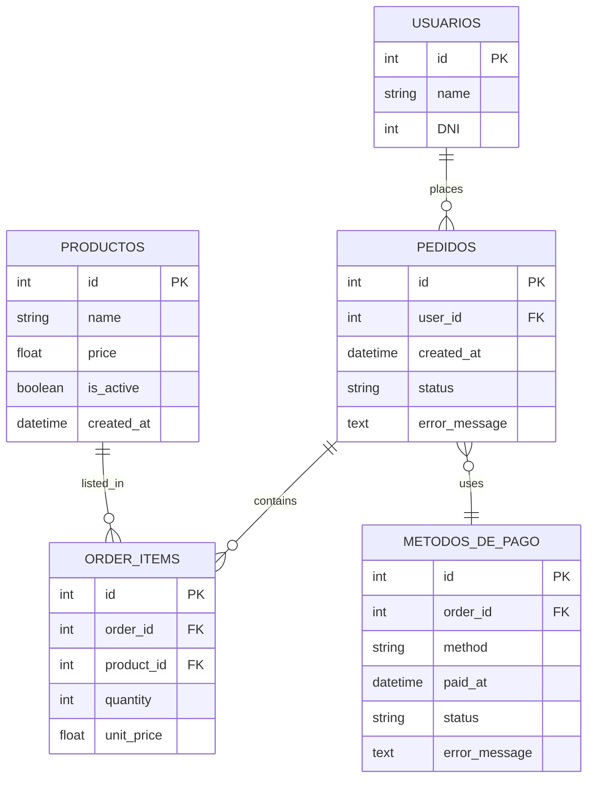

```mermaid
erDiagram
    USUARIOS ||--o{ PEDIDOS : places
    PEDIDOS ||--o{ ORDER_ITEMS : contains
    PRODUCTOS ||--o{ ORDER_ITEMS : listed_in
    PEDIDOS }o--|| METODOS_DE_PAGO : uses
    USUARIOS {
        int id PK
        string name
        int DNI
    }
    PRODUCTOS {
        int id PK
        string name
        float price
        boolean is_active
        datetime created_at
    }
    PEDIDOS {
        int id PK
        int user_id FK
        datetime created_at
        string status
        text error_message
    }
    ORDER_ITEMS {
        int id PK
        int order_id FK
        int product_id FK
        int quantity
        float unit_price
    }
    METODOS_DE_PAGO {
        int id PK
        int order_id FK
        string method
        datetime paid_at
        string status
        text error_message
    }
```

Enviar un mensaje a Ruben Garrido Piquer
